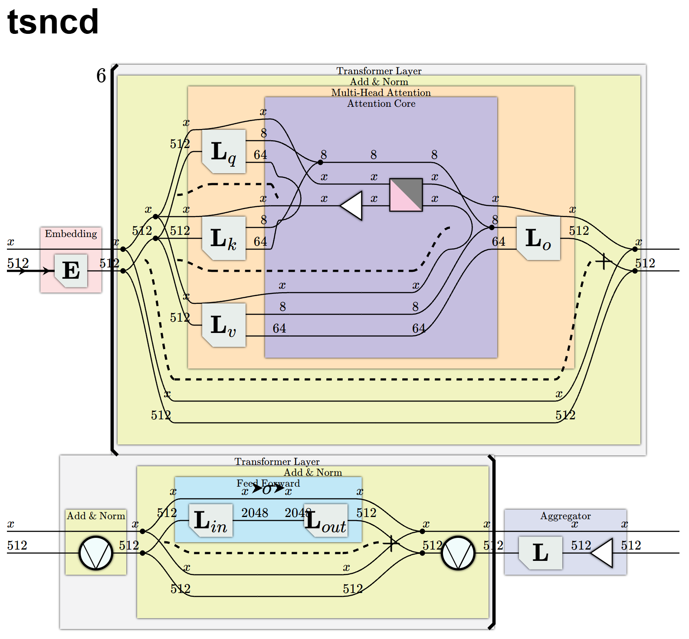
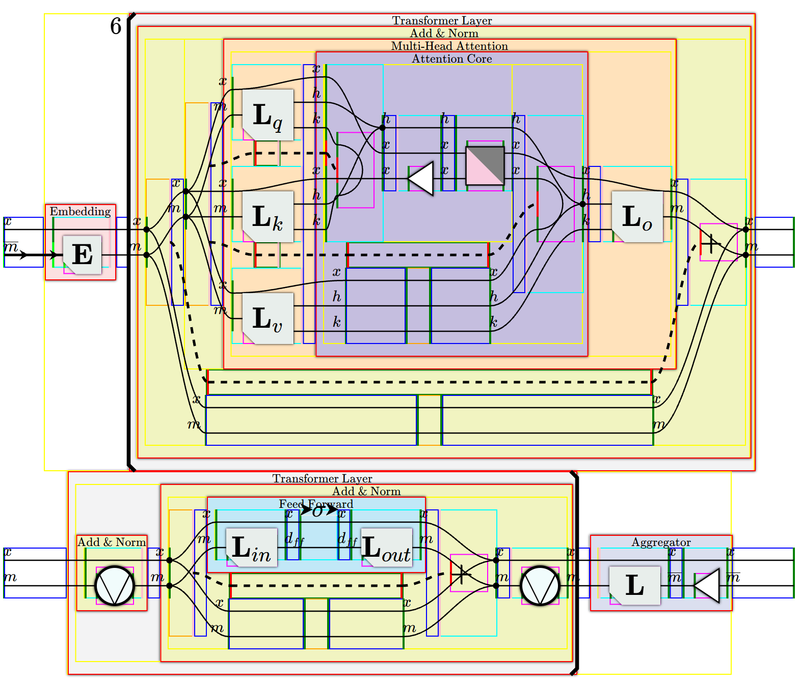

# tsncd


The TypeScript counterpart to [`pyncd`](https://github.com/mit-zardini-lab/pyncd). This package automatically generates diagrams from an algebraic description generated by `pyncd`. These packages communicate with each other using JSON and websockets, with the server hosted via `pyncd`'s `run_server.py`. The data structure from `pyncd` is imitated in `data_structure`. The code is modularized, so that `display` contains `Render` (data structure/category theory/HTML independent), `Framework` (HTML dependent), and finally `HTMLRender` (data structure/category theory independent). This allows the code to be extended to different frameworks (e.g. React) in the future. The `Framework` code takes advantage of the categorical structure. For example, multiline expressions are rendered so that $F$ is rendered as lines $F_0$ and $F_1$ so that $F_0; F_1 = F$.

Turning on `debugBorders` under `display/Render/RenderHandlerSettings.ts` shows the outlines of elements used to construct an expression.



# Setup
(1) Download nvm for [MacOS/Linux](https://github.com/nvm-sh/nvm) or [Windows](https://github.com/coreybutler/nvm-windows).

(2) Then, we need to run;
```
nvm install --lts
nvm use --lts
npm install -g npm@latest
npm install
npm run dev
```
*This hosts a brower app. On refresh, this connects to a `pyncd` server launched with `run_server.py` and renders data that has been sent to the server from `websockets_transfer.send_data(target)`.*